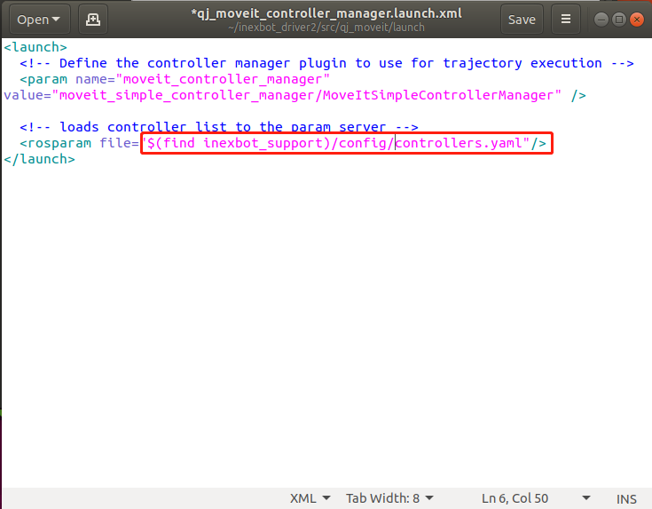

# ROS-1使用教程

本节为ROS的使用教程，包含创建工作空间、配置urdf 模型、通过 moveit 控制机器人、C++编程实现对机器人的控制。用户可参考以下视频。

NexDroid 与 ROS 结合-连接和使用

## 1.ROS 创建工作空间

```
mkdir -p ~/inexbot/src
cd ~/inexbot/src
catkin_init_workspace
```

如果出现


这种情况，则执行下面的命令

```
ls -al ~/inexbot/src
```

之后再运行工作空间初始化命令即可

```
catkin_init_workspace
cd ../
catkin_make
```

## 2. 修改~/.bashrc

```
gedit ~/.bashrc
```

然后在文件末尾添加

```
source ~/inexbot/devel/setup.bash
```

把所有 inexbot 的功能包复制到 inexbot/src 目录下

(inexbot 的功能包放在 下)

## 3. 对 moveit 和机器人的进行配置

使用 moveit 对一款机器人的 urdf 模型进行配置，生成的配置文件是 xxx_config 文件夹。里面的文件需要修改。

(1)安装 moveit

新打开一个终端

```
sudo apt-get install ros-melodic-moveit
source /opt/ros/melodic/setup.bash
sudo apt-get install ros-melodic-moveit-resources
```

安装后通过以下命令，启动moveit setup assistant

```
cd 工作空间
source ./devel/setup.bash
roslaunch moveit_setup_assistant setup_assistant.launch
```


将 inexbot_driver 文件中的两个文件夹拷贝进来

以及生成的 moveit 文件


将 qj_ws/src/inexbot_support/launch 中 moveit_planning_execution.launch 中所有默认的 moveit 文件夹名称改成 qj_moveit(moveit 文件夹的名字)


inexbot_support/config 中两个.yaml 文件 joints 名称改成 urdf 中的 joints name


qj_moveit/launch/qj_moveit_controller_manager.launch.xml 中红框内容改成(find inexbot_support)/config/controllers.yaml



打开终端

```
cd qj_ws
catkin_make
source devel/setup.bash
roslaunch inexbot_support moveit_planning_execution.launch  sim:=false robot_ip:=192.168.1.13
```

## 4.通过 moveit 控制机器人

##### 1.设置 Goal state 控制


​ 点击 plan 产生规划轨迹，底部会显示计算用时 Time。


​ 点击 execute 执行，也可以点击 plan&execute 规划完立即执行。

### 2.拖拽规划器控制

​ 拖拽规划器前端的绿色小球，光标放在小球上时，下方出现一个三维坐标，拖拽到目标点，点击 plan 产生规划轨迹，点击 execute 执行，也可以点击 plan&execute 规划完立即执行。


## 5.C++编程实现对机器人的控制

### 5.1 创建 ros 功能包，存放程序文件

```
cd ~/inexbot/src
catkin_create_pkg inexbot_code std_msgs rospy roscpp
cd ../
catkin_make
```

### 5.2 关节空间规划

#### 创建moveit_joint_demo.c

将文件放置到~/inexbot/src/inexbot_code/src路径下

```
//moveit_joint_demo.c
#include <ros/ros.h>
#include <moveit/move_group_interface/move_group_interface.h>
int main(int argc, char **argv)
{
    //ros的初始化
    ros::init(argc, argv, "moveit_joint_demo");
    ros::AsyncSpinner spinner(1);
    spinner.start();
    //manipulator是通过moveit设置的规划组
    moveit::planning_interface::MoveGroupInterface arm("manipulator");
    //容许误差
    arm.setGoalJointTolerance(0.001);
    //最大加速度
    arm.setMaxAccelerationScalingFactor(0.2);
    //最大速度
    arm.setMaxVelocityScalingFactor(0.2);
    // 设置goal_state,控制机械臂先回到初始化位置
    //home为moveit预设的位置
    arm.setNamedTarget("home");
    //运行
    arm.move();
    sleep(1);
    //设置关节空间的六个轴的角度
    double targetPose[6] = {0.391410, -0.676384, -0.376217, 0.0, 1.052834, 0.454125};
    std::vector<double> joint_group_positions(6);
    joint_group_positions[0] = targetPose[0];
    joint_group_positions[1] = targetPose[1];
    joint_group_positions[2] = targetPose[2];
    joint_group_positions[3] = targetPose[3];
    joint_group_positions[4] = targetPose[4];
    joint_group_positions[5] = targetPose[5];
    arm.setJointValueTarget(joint_group_positions);
    arm.move();
    sleep(1);
    // 控制机械臂先回到初始化位置
    arm.setNamedTarget("home");
    arm.move();
    sleep(1);
    ros::shutdown();
    return 0;
}


```

### 5.3 修改CMakeLists.txt文件

在 install 标签上面添加

```
add_executable(moveit_joint_demo src/moveit_joint_demo.cpp)


target_link_libraries(moveit_joint_demo ${catkin_LIBRARIES})


#############

## Install ##

#############


```

### 5.4 编译代码文件

```
cd ~/inexbot
catkin_make
```

### 5.5 运行

```
rosrun inexbot_code moveit_joint_demo
```
